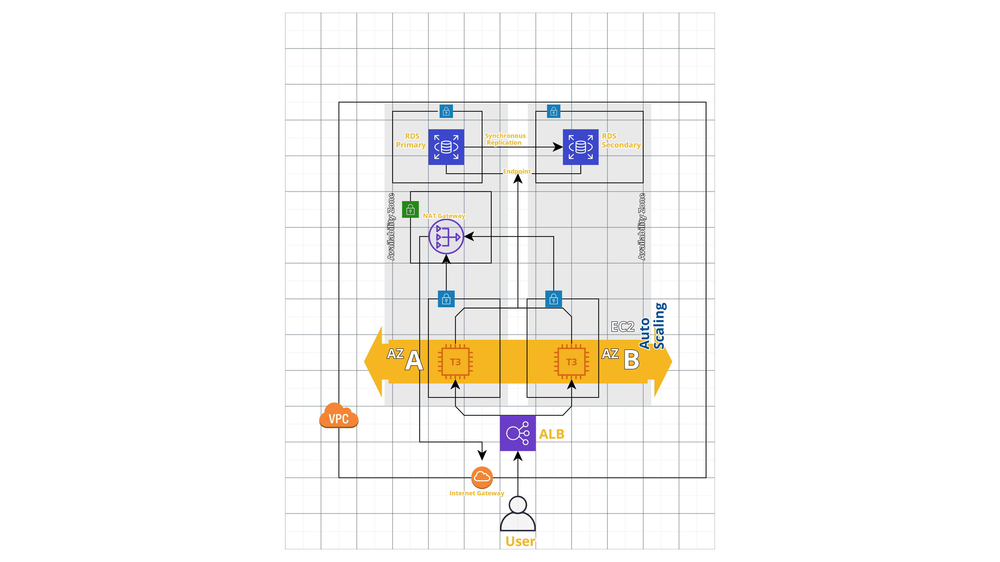

# To Do App with Terraform

This code base:

    * Sets up a higly scalable and highly available infrastructure on AWS using Terraform.
    * Deploys a GTD application.(servian/techchallengeapp)

### Infrastructure Components

The infrastructure on AWS has the below components.

* A VPC with Public and Private Subnets, Internet Gateway and NAT Gateway.
* Application Load Balancer, deployed in the Public Subnets, that routes external traffic to the application hosted on EC2 instances.
* Auto Scaling Group with Launch Configuration that deploys EC2 instances into the Private Subnets.
* Multi AZ RDS Postgres database in the private subnets.

### Application Components

* A GTD application that is deployed as a docker container into the EC2 instances that is spun up using the Auto Scaling Group and Launch Configuration.
    * The application is deployed as part of the User data for the Launch configuration.
    * The configuration file is dynamically generated and passed into the Launch configuration user data.
    * The application connects to the RDS Postgres database on port 5432.

### Security

* The whole solution is hosted inside AWS VPC.
* The single point of entry to the application is the Application Load Balancer. Everything else is isolated from the public internet.
* The EC2 instances are deployed into the private subnets.
    * They are allowed internet access via a NAT gateway and Internet gateway.
* The RDS Postgres database is deployed into the private subnets.
* All security groups have been locked down.
    * The ALB will only allow inbount traffic on port `80` from configured `ingress_cirds`.
    * EC2 security group will only allow traffic on port `3000` from the ALB security group.
    * The RDS Postgres database Security group will only allow traffic on port `5432` from the EC2 security group.

## How to deploy

### Pre-requisites

* [Terraform v0.14.3](https://learn.hashicorp.com/tutorials/terraform/install-cli) should be installed.
* AWS_ACCESS_KEY_ID and AWS_SECRET_ACCESS_KEY (This should be either given as an input to terraform while deploying or should bee configured in a file with `.tfvars` extension in this project directory.

### Deploy Steps

* Run `terraform -v` to make sure that terraform is installed.
* From the project root directory run `terraform init` to initialize provider plugins.
* Now run `terraform apply`. This start the deploy and should ask you to input the required variables(`access_key`, `secret_key` and `region`).
    * You can provide the values according to the prompts or provide variables on command line or create a file with `.tfvars` extension. [Offical Guide](https://www.terraform.io/docs/configuration/variables.html#variables-on-the-command-line)
    ``` bash
    $ terraform apply -var-file secrets.tfvars # OR
    $ terraform apply -var="access_key=AXXXXXXXXXAA" -var="secret_key=xxxxxxxxxxxx"  -var="region=ap-southeast-2"
    ```
* After `terraform` has completed the deploy, the console should show an `application_url` as an output.
    * If the application does not load straight away please wait for a few minutes before trying again. Sometimes it might take some time for the target groups to register healthy EC2 instances.

## Terraform Variables

The below table shows the variables you should set/can override.
| Variable   |      Description      |  Required/Optional |
|----------|:-------------:|------:|
| `access_key` |  `AWS_ACCESS_KEY` for your AWS account | Required |
| `secret_key`|    `AWS_SECRET_ACCESS_KEY` for your AWS account   |  Required |
| `region` | AWS region where you want to deploy the infrastructure |   Required |
| `instance_type` | EC2 instance type | Optional(Defaults to `t3.micro`) |
| `db_instance_type` | RDS instance type | Optional(Defaults to `db.t2.micro`) |
| `database_name` | Default database name(RDS will create this database inside Postgres) | Optional(Defaults to `app`) |
| `database_username` | Username for postgres database | Optional(Defaults to `postgres`) |
| `db_multiaz` | Enable MultiAZ for database | Optional(Defaults to `true`) |
| `db_identifier_prefix` | Database identifier prefix for database | Optional(Defaults to `techapp-db-1`) |
| `db_skip_final_snapshot` | Disable this if a final snapshot needs to be take before deleting the datbase | Optional(Defaults to `true`) |
| `ingress_cidrs` | Ingress CIDRs for your ALB Security Group |   Optional(Defaults to the whole internet `0.0.0.0/0` which is not recommended) |
| `db_max_allocated_storage` | The maximum storage amount RDS will scale the database to. |   Optional(Defaults to `30` GB) |
| `min_asg_size` | The minimum number of EC2 instances the ASG should create. |   Optional(Defaults to `2`) |
| `max_asg_size` | The maximum number of EC2 instances the ASG should create. |   Optional(Defaults to `5`) |

## Application Risks

* There is no security hardening applied on the `ami`.
* There is no monitoring enabled for the application or the RDS database.

## Future Improvements for this repo

* EC2 instances and RDS are in the same private subnet group. It's probably better to move RDS to a different private subnet group.
* Provide an option to create a `bastion` instance in the public subnet in case developers want to access the EC2 instances that host the application.
* Forward application and database logs to Cloudwatch Logs.
* Deploy NAT gateway on multiple AZs.
* Terraform state file should be stored in S3 and encrpyted as it contains secrets.
* Split the whole terraform project into modules so that code can be reused.
* Add cost tracking tags for all the resources.

## Current Issues

* It has been noticed that sometimes the password generated by the random password generator is not accepted by the RDS database as it contains some characters that are not valid for RDS. Please re-run `terraform apply` again and it should get solved.

# General Architecture Diagram


